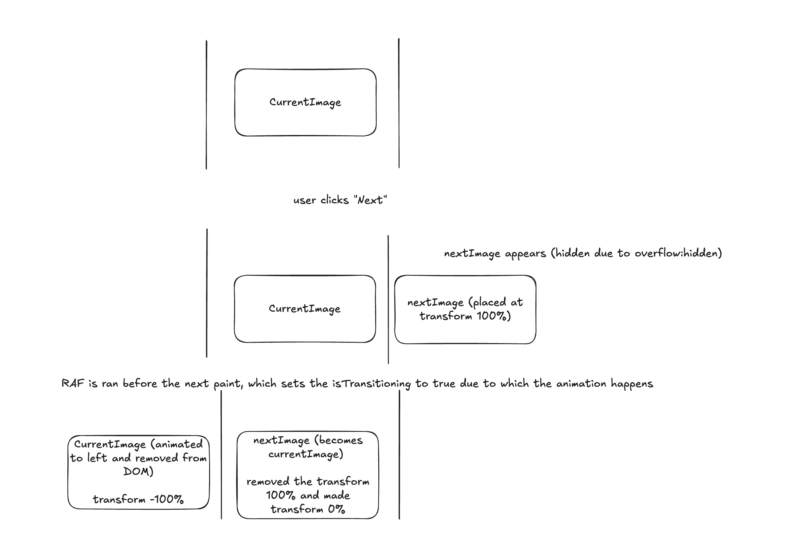

## [Image Carousel III](https://www.greatfrontend.com/questions/user-interface/image-carousel-iii/react)

`Approx time - 30 minutes`

This question optimizes Image Carousel II by **limiting the DOM to a maximum of 2 images** at any time (instead of rendering all images).

### What Does Optimization Mean Here?

**Image Carousel II:**

- All images rendered to DOM at once
- Uses `transform: translateX()` to slide the entire row
- Memory: O(n) where n = number of images

**Image Carousel III:**

- Maximum 2 images in DOM during transition (1 image when idle)
- Dynamically adds/removes images as needed
- Memory: O(1) - constant

### How It Works

**When you click "Next":**

1. Next image is added to DOM **off-screen right** (`translateX(100%)`)
2. Using `requestAnimationFrame`, next image slides to center (`translateX(0%)`)
3. Simultaneously, current image slides off-screen left (`translateX(-100%)`)
4. After transition ends, current image is removed from DOM

**When you click "Previous":**

1. Previous image is added to DOM **off-screen left** (`translateX(-100%)`)
2. Using `requestAnimationFrame`, previous image slides to center (`translateX(0%)`)
3. Simultaneously, current image slides off-screen right (`translateX(100%)`)
4. After transition ends, current image is removed from DOM

### The Key: `requestAnimationFrame`

#### Why We Need It

```ts
const changeImageIndex = (index: number) => {
  setNextIndex(index); // Add next image to DOM

  requestAnimationFrame(() => {
    // Wait for paint
    setIsTransitioning(true); // Start transition
  });
};
```

**Without RAF:**

```
setNextIndex(3);          // Add image to DOM
setIsTransitioning(true); // Start transition
↓
React batches both updates
↓
Browser paints ONCE with both changes applied
↓
Next image appears at final position instantly (no animation!)
```

**With RAF:**

```
setNextIndex(3);
↓
React render → commit
↓
Browser paints Frame 1: Next image at translateX(100%)
↓
RAF callback fires
↓
setIsTransitioning(true);
↓
React render → commit
↓
Browser paints Frame 2: Next image at translateX(0%)
↓
CSS transition animates between Frame 1 and Frame 2!
```

#### React + Browser Rendering Pipeline

**Complete flow:**

1. **Trigger Phase:** `setState` called, updates batched
2. **Render Phase:** React runs component, creates virtual DOM, reconciliation
3. **Commit Phase:** React updates real DOM
4. **useLayoutEffect:** Runs synchronously (blocks paint)
5. **Browser Paint Frame 1:** Screen updates
6. **useEffect:** Runs asynchronously (after paint)
7. **RAF callback fires:** Before next frame
8. If RAF has `setState` → repeat from step 1
9. **Browser Paint Frame 2:** Screen updates again
10. **CSS Transition:** Browser interpolates between Frame 1 and Frame 2

**Key timing:**

- `useLayoutEffect`: Before paint (synchronous)
- `useEffect`: After paint (asynchronous)
- `requestAnimationFrame`: Before **next** paint

#### Where Animation Happens

**Animations happen between two paint frames:**

```
Paint Frame 1: Element at position A (starting position)
               ↓
           [RAF callback runs]
               ↓
Paint Frame 2: Element at position B (ending position)
               ↓
        [CSS transition animates]
               ↓
Paint Frame 3, 4, 5... (interpolated positions during 0.5s transition)
```

The browser's CSS transition engine smoothly interpolates the position over multiple frames until the transition duration completes.

### Step-by-Step Execution

**1. Initial state:**

```ts
currIndex = 0; // Current image showing
nextIndex = null;
isTransitioning = false;
```

**2. User clicks Next button:**

```ts
changeImageIndex(1); // Called
```

**3. First state update executes:**

```ts
setNextIndex(1); // nextIndex now 1, nextImage added to DOM
// RAF callback scheduled but NOT executed yet
```

**4. React render → commit → Browser paints Frame 1:**

- Current image: visible at center
- Next image: added to DOM at `translateX(100%)` (off-screen right)
- Both images now in DOM

**5. RAF callback executes (before Frame 2):**

```ts
setIsTransitioning(true); // Triggers new render cycle
```

**6. React render → commit → Browser paints Frame 2:**

- Current image: `translateX(-100%)` - sliding left
- Next image: `translateX(0%)` - sliding to center
- CSS transitions animate both changes

**7. Transition completes (0.5s later):**

```ts
onTransitionEnd={() => {
  setCurrIndex(1);        // Next becomes current
  setNextIndex(null);     // Remove next
  setIsTransitioning(false);
}}
```

**8. Back to idle:**

- Only current image (was next) remains in DOM
- Previous image removed

### Why RAF is Critical

**CSS transitions require TWO separate paint frames:**

**Frame 1:** Browser must paint element at starting position  
**Frame 2:** Browser must paint element at ending position  
**Animation:** Browser interpolates between frames

**Without RAF:** Both positions calculated in same frame → no animation  
**With RAF:** Positions calculated in separate frames → smooth animation

### Key Takeaways

- **Maximum 2 images in DOM** during transition (1 when idle)
- **RAF ensures two paint frames** for CSS transitions to work
- **Transition timing:** Frame 1 (start) → RAF → Frame 2 (end) → Animation
- **Direction logic:** `shouldTransitionToLeftDirection` determines slide direction
- **Boolean logic:** `!isTransitioning && enterClassname` controls when classes apply

---

### Things Learnt

- `requestAnimationFrame` runs **before the next paint**, not after current paint
- RAF is essential for CSS transitions on dynamically added elements
- Animation happens **between multiple paint frames**, not in a single frame
- React batches state updates, which can prevent animations without RAF
- `onTransitionEnd` event signals when CSS transition completes
- Memory optimization: O(n) images → O(1) images in DOM
- **Why `key` is very important on image? [Learn on my codevizual.com](http://codevizual.com/image-carousel)**

#### Flow


