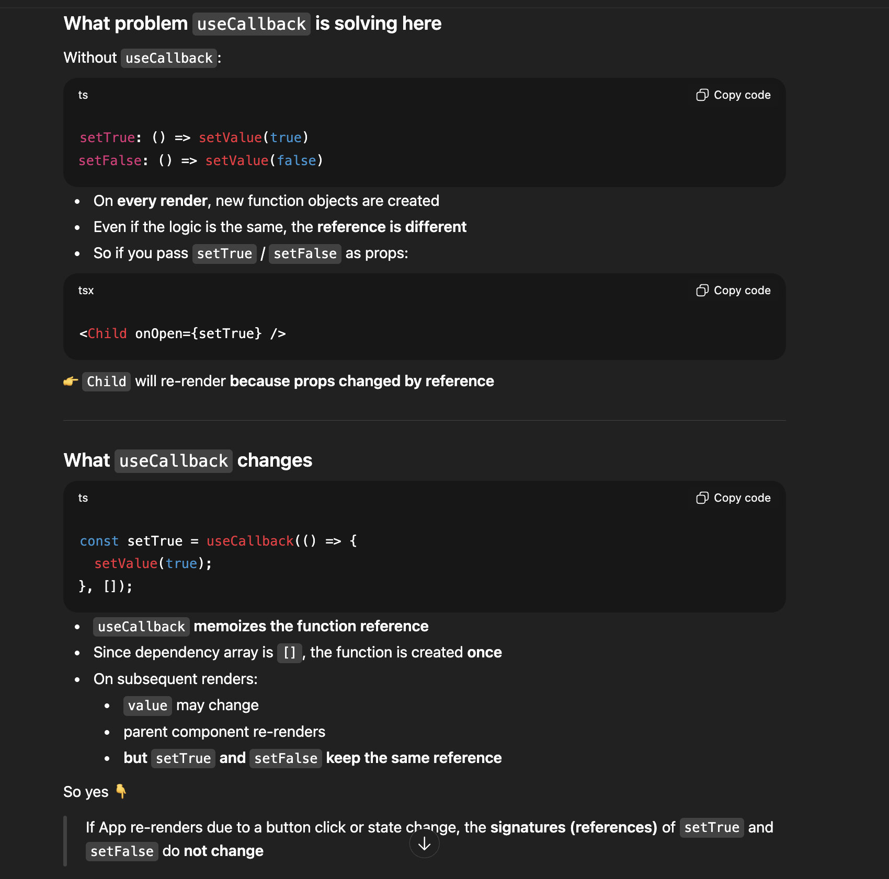

## [useBoolean](https://www.greatfrontend.com/questions/javascript/use-boolean?framework=react&tab=coding)

`Approx time - 5m`

```ts
function useBoolean(initialValue?: boolean): UseBooleanReturn {
  const [value, setValue] = useState(!!initialValue);

  const setTrue = useCallback(() => {
    return setValue(true);
  }, []);

  const setFalse = useCallback(() => {
    return setValue(false);
  }, []);

  return {
    value,
    setTrue,
    setFalse,
  };
}
```

This is from `useBoolean II`. We can use useCallback hook to wrap our functions setTrue and setFalse.


